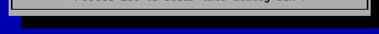

# Specification for MDEC [MS-Dos Edit Clone]

## Technical Specifications

## Design Specifications

MDEC is a text editor, the base design is from the MSDOS "Edit" editor.

**1-a** Opening screen, upon startup with no file opened the display should appear like this. The welcome dialogue should have up to date relevant Copyright info and basic instructions to access the help files and close the dialogue.

**1-b** With file open, file should be displayed in fixed font size within in the window confines. Word wrapping should happen at a fixed margin~~, about 1 and one half inch from the right edge bar/scroll bar~~. Menu bar displays various sub menus ~~and total columns and lines~~. File name should be displayed in the title display at the top center of the window. Info bar diplays "F1 = Help" and line and column number for cursor.

**1-c** Simple windowing, clicking on the title/file name and dragging it downward creates an identical window, with which you can open another file.

**1-d** Windowing. More than one, overlaping windows can exist at the same time, creating a desktop type interface. Snapping to sides and tops of the "desktop" would be luxury features. *This is future functionality: Ideally, some widgets would follow, clock, timer, calender, etc.*

**1-e, 1-f** Header/Menu bars.

**1-g, 1-h** Window bar/ file name title bar.

**1-i** Main font.

**1-j** Background color for dialogs, the windows seperation bar, and the menu and info bars.

**1-k** background color for windows.

**1-l** Drop shadowing for dialog and text edit windows.

**1-m, 1-n** Info bar, existing at the bottom holds basic help and cursor position info.

